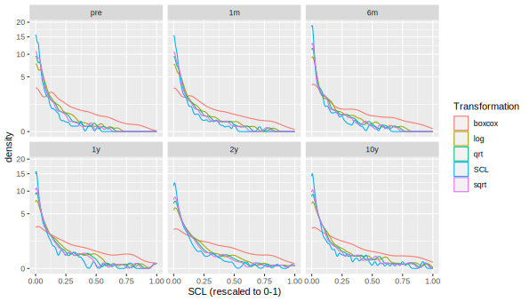
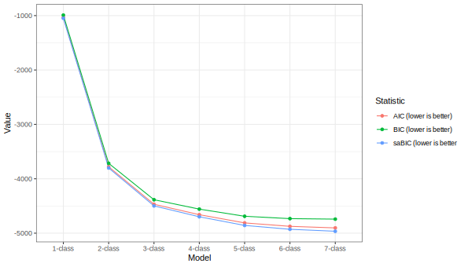
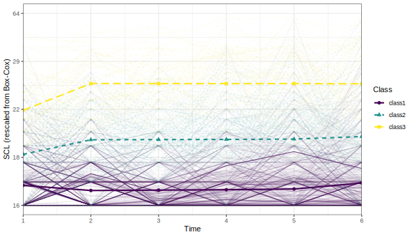

```{r setup, include=T, results='hide', message=FALSE, warning=FALSE}
library("worcs")
library(tidySEM)
library(ggplot2)
library(MASS)
run_everything = FALSE
options(digits = 2)
load_data()
if(!file.exists("out.yml")){
  yaml::write_yaml(list(), "out.yml")
} 
out <- yaml::read_yaml("out.yml")
knitr::opts_chunk$set(echo = TRUE, message = FALSE, warning = FALSE)
```

This manuscript uses the Workflow for Open Reproducible Code in Science [@vanlissaWORCSWorkflowOpen2020] to ensure reproducibility and transparency. 
**NOTE: The code is not yet in a repository, but I do recommend it:**

All code <!--and data--> are available at <git@[...].git>.

<!--The function below inserts a notification if the manuscript is knit using synthetic data. Make sure to insert it after load_data().-->
`r notify_synthetic()`

# Data cleaning

We first examined item descriptives.
All items were extremely right-skewed due to censoring at the lower end of the scale.

```{r tabdesc, results='asis'}
# Get descriptives
desc <- descriptives(df)
desc <- desc[, !colSums(is.na(desc)) == nrow(desc)]
knitr::kable(desc, caption = "Item descriptives")
```

Item-level missingness ranged from $[`r report(min(desc[["missing"]]), equals = F)`, `r report(max(desc[["missing"]]), equals = F)`]$
We used the missForest algoritm for single imputation;
this approach interpolates missing values based on a random forest model (a flexible machine learning model) of all other variables.
Simulation studies have shown that its performance is comparable to multiple imputation [REF Stekhoven].

```{r impute, eval=run_everything}
# Use single imputation
df <- df[, grepl("^SCL", names(df))]
names(df) <- gsub("^SCL_(.)_(\\d+)$", "SCL\\2_\\1", names(df))
set.seed(73274)
df_imp <- missRanger::missRanger(df)
saveRDS(df_imp, "df_imp.RData")
```

## Scale descriptives

Next, we computed sum scores for each wave and examined scale descriptives.

```{r scaledesc, eval=run_everything}
# Compute scale scores
df_imp <- readRDS("df_imp.RData")
df_scl <- df_imp
names(df_scl) <- gsub("^SCL(\\d+)_(.)$", "SCL_\\2_\\1", names(df_scl))
#df_scl[] <- lapply(df_scl, function(i){as.integer(as.character(i))})
if(anyNA(df_scl)) stop("Requires complete data")
scl <- tidy_sem(as.data.frame(df_scl))
scl_scales <- create_scales(scl, totals = TRUE)
desc <- scl_scales$descriptives
write.csv(desc, "scale_desc.csv", row.names = FALSE)
```

```{r tabscaledesc, results='asis'}
desc <- read.csv("scale_desc.csv", stringsAsFactors = FALSE)
knitr::kable(desc, getOption("digits"))
```

Reliability ranged from good to excellent in all waves.
Like the individual items, however,
these scores were extremely skewed and peaked (at zero).
As preliminary analyses indicated that this skew resulted in model convergence problems in LCGA,
we compared several transformations to reduce skew:
The square and cube root, log, inverse, and Box-Cox transformations.

```{r transform, eval = run_everything}
df_scores <- scl_scales$scores
df_scores <- reshape(df_scores, direction= "long", varying = names(df_scores), sep = "_")
out[["rng_scl"]] <- range(df_scores$SCL)

df_scores$log <- scales::rescale(log(df_scores$SCL), to = c(0, 1))
df_scores$sqrt <- scales::rescale(sqrt(df_scores$SCL), to = c(0, 1))
df_scores$qrt <- scales::rescale(df_scores$SCL^.33, to = c(0, 1))
df_scores$reciprocal <- scales::rescale(1/df_scores$SCL, to = c(0, 1))
bc <- function(x, lambda){
  (((x ^ lambda) - 1) / lambda)
}
invbc <- function(x, lambda){
  ((x*lambda)+1)^(1/lambda)
}
b <- MASS::boxcox(lm(df_scores$SCL ~ 1))
lambda <- b$x[which.max(b$y)]

df_scores$boxcox <- bc(df_scores$SCL, lambda)
out[["rng_bc"]] <- range(df_scores$boxcox)
df_scores$boxcox <- scales::rescale(df_scores$boxcox, to = c(0, 1))
df_scores$SCL <- scales::rescale(df_scores$SCL, to = c(0, 1))
df_plot <- do.call(rbind, lapply(c("SCL", "log", "sqrt", "qrt", "boxcox"), function(n){
  data.frame(df_scores[c("time", "id")],
             Value = df_scores[[n]],
             Transformation = n)
}))
p_trans <- ggplot(df_plot, aes(x = Value, colour = Transformation)) + geom_density() + facet_wrap(~time) + scale_y_sqrt() + xlab("SCL (rescaled to 0-1)")
ggsave("transformations.svg", p_trans, device = "svg", width = 210, height = 120, units = "mm")
```

```{r figtrans, fig.cap="Different transformations to reduce skew"}

```
The Box-Cox transformation clearly reduced skew the most.
Consequently, we proceeded with the Box-Cox transformed scores for analysis.
Via this transformation, patterns of heterogeneity between participants can be examined in more detail.

```{r eval = run_everything}
dat <- df_scores[, c("id", "time", "boxcox")]
dat <- reshape(dat, direction = "wide", v.names = "boxcox", timevar = "time", idvar = "id")
names(dat) <- gsub("boxcox.", "scl_", names(dat))
closed_data(dat)
```

# Latent Class Growth Analysis

Next, we estimated a latent class growth analysis
for SCL.
The model included an overall intercept, centered at T1.
To model the potential effect of deployment on
depresion,
we also included a dummy variable that was zero before
deployment, and 1 after deployment.
Finally, to model potential change (or recovery) in depression post-deployment,
we included a linear slope from T2-T6.
All variances of growth parameters were fixed to zero due to the sparse nature of the data.

**NOTE: You still have to change the time scales in this model; it currently assumes that all measurements are equidistant, but that's not true.**

```{r lcga, eval=run_everything}
library(worcs)
library(tidySEM)

# Set this condition to TRUE if you really want to re-run the LCGA. 
# It will take a LONG time!
if(!file.exists("res_step.RData")){
  set.seed(699648)
dat <- read.csv("dat.csv", stringsAsFactors = FALSE)
dat[["id"]] <- NULL
names(dat) <- paste0("scl", 1:6)

# Standard LCGA
# This is not run, because you 
# have to account for the fact that
# there may be an effect of deployment
# (the "step function", basically a dummy
# variable for changes due to deployment).
# I only report this here so you see
# how it's done.
# res <- mx_growth_mixture(
#   model =
# "i =~ 1*scl1 + 1*scl2 + 1*scl3 +1*scl4 +1*scl5 +1*scl6
# s =~ 0*scl1 + 1*scl2 + 2*scl3 +3*scl4 +4*scl5 +5*scl6
# scl1 ~~ vscl1*scl1
# scl2 ~~ vscl2*scl2
# scl3 ~~ vscl3*scl3
# scl4 ~~ vscl4*scl4
# scl5 ~~ vscl5*scl5
# scl6 ~~ vscl6*scl6
# i ~~ 0*i
# s ~~ 0*s
# i ~~ 0*s", classes = 1:3,
#   data = dat)
# # In case of convergence problems in the first model:
# res[[1]] <- mxTryHardWideSearch(res[[1]])
# saveRDS(res, "lcga.RData")
# table_fit(res)


# LCGA with step function for effect of deployment
set.seed(67426)
res_step <- mx_growth_mixture(
  model =
"i =~ 1*scl1 + 1*scl2 + 1*scl3 +1*scl4 +1*scl5 +1*scl6
step =~ 0*scl1 + 1*scl2 + 1*scl3 +1*scl4 +1*scl5 +1*scl6
s =~ 0*scl1 + 0*scl2 + 1*scl3 +2*scl4 +3*scl5 +4*scl6
scl1 ~~ vscl1*scl1
scl2 ~~ vscl2*scl2
scl3 ~~ vscl3*scl3
scl4 ~~ vscl4*scl4
scl5 ~~ vscl5*scl5
scl6 ~~ vscl6*scl6
i ~~ 0*i
step ~~ 0*step
s ~~ 0*s
i ~~ 0*s
i ~~ 0*step
s ~~ 0*step", classes = 1:7,
  data = dat)
# In case of convergence problems in the first model:
# res[[1]] <- mxTryHardWideSearch(res[[1]])
saveRDS(res_step, "res_step.RData")
} else {
  res_step <- readRDS("res_step.RData")
}
tab_fit <- table_fit(res_step)
tab_res <- table_results(res_step[[3]])
wald_tests <- tidySEM::wald_test(res_step[[3]], 
                   "class1.M[1,7] = class2.M[1,7]&class1.M[1,7] = class3.M[1,7];class1.M[1,8] = class2.M[1,8]&class1.M[1,8] = class3.M[1,8];class1.M[1,9] = class2.M[1,9]&class1.M[1,9] = class3.M[1,9]")
wald_tests$Hypothesis <- c("Mean i", "Mean step", "Mean slope")
write.csv(tab_fit, "tab_fit_res_step.csv", row.names = FALSE)
write.csv(tab_res, "tab_res_res_step_3.csv", row.names = FALSE)
write.csv(wald_tests, "tab_wald_res_step_3.csv", row.names = FALSE)
p <- tidySEM:::plot.tidy_fit(tab_fit, statistics = c("AIC", "BIC", "saBIC"))
ggsave("plot_scree.svg", p, device = "svg", width = 210, height = 120, units = "mm")
```


## Class enumeration

To determine the correct number of classes, we considered the following criteria:

1. We do not consider classes with, on average, fewer than 5 participants per parameter in a class due to potential local underidentification
1. Lower values for information criteria (AIC, BIC, saBIC) indicate better fit
1. Significant Lo-Mendell-Rubin LRT test indicates better fit for $k$ vs $k-1$ classes
1. We do not consider solutions with entropy < .90 because poor class separability compromises interpretability of the results
1. We do not consider solutions with minimum posterior classification probability < .90 because poor class separability compromises interpretability of the results

```{r tabfit, results = "asis"}
tab_fit <- read.csv("tab_fit_res_step.csv", stringsAsFactors = FALSE)
tab_fit <- tab_fit[,c("Name", "Minus2LogLikelihood", "Parameters", "df", "AIC", "BIC", "saBIC", "Entropy", "prob_min", 
"prob_max", "n_min", "n_max", "lmr_lr", "lmr_p")]
knitr::kable(tab_fit, digits = 2, caption = "Fit of LCGA models")
```

According to the Table, increasing the number of classes keeps increasing model fit according to all ICs.
All LMR tests are significant.
However, solutions with >3 classes had entropy and minimum posterior classification probability below the pre-specified thresholds.
Models with >3 solutions also had fewer than five observations per parameter.
This suggests that the preferred model should be selected from 1-3 classes.

### Scree plot

A scree plot indicates that
the largest decrease in ICs occurs from 1-2 classes,
and the inflection point for all ICs is at 3 classes.
A three-class solution thus appears to be the most parsimonious
solution with good fit.

```{r plotscree}

```


## Selected model

Based on the aforementioned criteria,
we selected a 3-class model for further analyses.
The estimated parameters are reported below.

```{r tabres, results='asis'}
tab_res <- read.csv("tab_res_res_step_3.csv", stringsAsFactors = FALSE)
tab_res <- tab_res[!grepl("^mix", tab_res$label), ]
knitr::kable(tab_res, digits = 2, caption = "Results from 3-class LCGA model")
```

As evident from these results, 
Class 1 started at a moderate level of depressive symptoms,
experienced an increase after deployment,
followed by significant increase over time from T2-T6.
Class 2 started at a relatively lower level of depressive symptoms,
experienced a decrease after deployment,
followed by increase over time.
Class 3 started at a relatively higher level,
experienced an increase after deployment, followed by stability.
As evident from the table below, the differences between classes in intercept and step are significant.

```{r waldtests, results='asis'}
wald_tests <- read.csv("tab_wald_res_step_3.csv", stringsAsFactors = FALSE)
knitr::kable(wald_tests, digits = 2, caption = "Wald tests")
```

## Trajectory plot

```{r makelcgaplot, eval = run_everything}
p <- tidySEM::plot_growth(res_step[[3]], rawdata = TRUE, alpha_range = c(0, .05))
brks <- seq(0, 1, length.out = 5)
labs <- round(invbc(scales::rescale(brks, from = c(0, 1), to = out$rng_bc), lambda))
p <- p + scale_y_continuous(breaks = seq(0, 1, length.out = 5), labels = labs) + ylab("SCL (rescaled from Box-Cox)")
ggsave("lcga_trajectories.svg", p, device = "svg", width = 210, height = 120, units = "mm")
```

```{r plotlcga}

```

Note that the observed individual trajectories show very high variability within classes.


```{r}
yaml::write_yaml(out, "out.yml")
```

