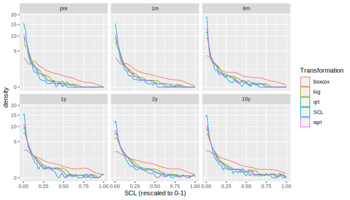
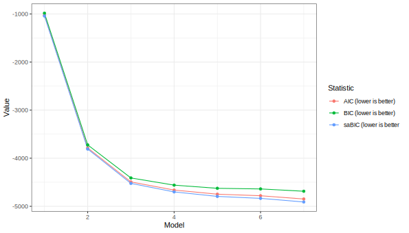

```{r setup, include=T, results='hide', message=FALSE, warning=FALSE}
library(svglite)
library(readxl)
library(dplyr)
library(tidySEM)
library(ggplot2)
library(lavaan)
library(missRanger)
library(MASS)

# Define path to save files
save_location = "~/Documents/PhD/p_PRISMO/Trajectanalyse Depressie/prismo_trajectanalysis/"

# Set working directory
setwd(dirname(save_location))

# run everything? (takes a long time if TRUE)
run_everything = FALSE
options(digits = 2)

# read data
df <- read_excel(paste(save_location, "df_total.xlsx", sep = ""))
df <- df %>%
  filter(all_na_in_outcome_var == 0)

# select columns
df <- df[grepl("^.SCL\\d+$", names(df))]
names(df) <- gsub("^(.).+?(\\d+)$", "SCL_\\1_\\2", names(df))


if(!file.exists("out.yml")){
  yaml::write_yaml(list(), "out.yml")
} 
out <- yaml::read_yaml("out.yml")
knitr::opts_chunk$set(echo = TRUE, message = FALSE, warning = FALSE)
```


All code <!--and data--> are available at <git@[...].git>.

# Data cleaning

We first examined item descriptives.
All items were extremely right-skewed due to censoring at the lower end of the scale.

```{r tabdesc, results='asis'}
# Get descriptives
desc <- descriptives(df)
desc <- desc[, !colSums(is.na(desc)) == nrow(desc)]
knitr::kable(desc, caption = "Item descriptives")
```

Item-level missingness ranged from $[`r report(min(desc[["missing"]]), equals = F)`, `r report(max(desc[["missing"]]), equals = F)`]$
We used the missForest algoritm for single imputation;
this approach interpolates missing values based on a random forest model (a flexible machine learning model) of all other variables.
Simulation studies have shown that its performance is comparable to multiple imputation [REF Stekhoven].

```{r impute, eval=run_everything}
# Use single imputation
df <- df[, grepl("^SCL", names(df))]
names(df) <- gsub("^SCL_(.)_(\\d+)$", "SCL\\2_\\1", names(df))
set.seed(73274)
df_imp <- missRanger::missRanger(df)
saveRDS(df_imp, "manuscript/df_imp.RData")
```

## Scale descriptives

Next, we computed sum scores for each wave and examined scale descriptives.

```{r scaledesc, eval=run_everything}
# Compute scale scores
df_imp <- readRDS("manuscript/df_imp.RData")
df_scl <- df_imp
names(df_scl) <- gsub("^SCL(\\d+)_(.)$", "SCL_\\2_\\1", names(df_scl))
#df_scl[] <- lapply(df_scl, function(i){as.integer(as.character(i))})
if(anyNA(df_scl)) stop("Requires complete data")
scl <- tidy_sem(as.data.frame(df_scl))
scl_scales <- create_scales(scl, totals = TRUE)
desc <- scl_scales$descriptives
write.csv(desc, "manuscript/scale_desc.csv", row.names = FALSE)
```

```{r tabscaledesc, results='asis'}
desc <- read.csv("manuscript/scale_desc.csv", stringsAsFactors = FALSE)
knitr::kable(desc, getOption("digits"))
```

Reliability ranged from good to excellent in all waves.
Like the individual items, however,
these scores were extremely skewed and peaked (at zero).
As preliminary analyses (see measurement_invariance.R) indicated that this skew resulted in model convergence problems in LCGA,
we compared several transformations to reduce skew:
The square and cube root, log, inverse, and Box-Cox transformations.

```{r transform, eval = run_everything}
df_scores <- scl_scales$scores
df_scores <- reshape(df_scores, direction= "long", varying = names(df_scores), sep = "_")
out[["rng_scl"]] <- range(df_scores$SCL)

df_scores$log <- scales::rescale(log(df_scores$SCL), to = c(0, 1))
df_scores$sqrt <- scales::rescale(sqrt(df_scores$SCL), to = c(0, 1))
df_scores$qrt <- scales::rescale(df_scores$SCL^.33, to = c(0, 1))
df_scores$reciprocal <- scales::rescale(1/df_scores$SCL, to = c(0, 1))
bc <- function(x, lambda){
  (((x ^ lambda) - 1) / lambda)
}
invbc <- function(x, lambda){
  ((x*lambda)+1)^(1/lambda)
}
b <- MASS::boxcox(lm(df_scores$SCL ~ 1))
lambda <- b$x[which.max(b$y)]

out[["lambda"]] <- lambda
df_scores$boxcox <- bc(df_scores$SCL, lambda)
out[["rng_bc"]] <- range(df_scores$boxcox)

df_scores$boxcox <- scales::rescale(df_scores$boxcox, to = c(0, 1))
df_scores$SCL <- scales::rescale(df_scores$SCL, to = c(0, 1))
df_plot <- do.call(rbind, lapply(c("SCL", "log", "sqrt", "qrt", "boxcox"), function(n){
  data.frame(df_scores[c("time", "id")],
             Value = df_scores[[n]],
             Transformation = n)
}))

labels <- c("A" = "pre", "B" = "1m", "C" = "6m", "D" = "1y", "E" = "2y", "G" = "10y")
time.labs <- c("pre", "1m", "6m", "1y", "2y", "10y")
names(time.labs) <- c("A", "B", "C", "D", "E", "G")

p_trans <- ggplot(df_plot, aes(x = Value, colour = Transformation)) + geom_density() + facet_wrap(~time, labeller = labeller(time=time.labs)) + scale_y_sqrt() + xlab("SCL (rescaled to 0-1)")
ggsave("manuscript/transformations.svg", p_trans, device = "svg", width = 210, height = 120, units = "mm")
```

```{r figtrans, fig.cap="Different transformations to reduce skew"}

```
The Box-Cox transformation clearly reduced skew the most.
Consequently, we proceeded with the Box-Cox transformed scores for analysis.
Via this transformation, patterns of heterogeneity between participants can be examined in more detail.

```{r eval = run_everything}
dat <- df_scores[, c("id", "time", "boxcox")]
dat <- reshape(dat, direction = "wide", v.names = "boxcox", timevar = "time", idvar = "id")
names(dat) <- gsub("boxcox.", "scl_", names(dat))
```

# Latent Class Growth Analysis

Next, we estimated a latent class growth analysis
for SCL.
The model included an overall intercept, centered at T1.
To model the potential effect of deployment on
depression,
we also included a dummy variable that was zero before
deployment, and 1 after deployment.
Finally, to model potential change (or recovery) in depression post-deployment,
we included a linear and quadratic slope from T2-T6.
All variances of growth parameters were fixed to zero due to the sparse nature of the data.


```{r lcga, eval=run_everything}
library(worcs)
library(tidySEM)

# Set this condition to TRUE if you really want to re-run the LCGA. 
# It will take a LONG time!

if(run_everything){
  
  set.seed(699648)
  dat[["id"]] <- NULL
  names(dat) <- paste0("scl", 1:6)
  dat <- data.frame(dat)
  # write.csv(dat, paste(save_location, "manuscript/lcga_dat_scl.csv", sep = ""), row.names = FALSE)
  
  # LCGA with step function for effect of deployment
  set.seed(67426)
  res_step <- mx_growth_mixture(
    model =
  "i =~ 1*scl1 + 1*scl2 + 1*scl3 +1*scl4 +1*scl5 +1*scl6
  step =~ 0*scl1 + 1*scl2 + 1*scl3 +1*scl4 +1*scl5 +1*scl6
  s =~ 0*scl1 + 0*scl2 + 1*scl3 + 2*scl4 + 4*scl5 + 20*scl6
  scl1 ~~ vscl1*scl1
  scl2 ~~ vscl2*scl2
  scl3 ~~ vscl3*scl3
  scl4 ~~ vscl4*scl4
  scl5 ~~ vscl5*scl5
  scl6 ~~ vscl6*scl6
  i ~~ 0*i
  step ~~ 0*step
  s ~~ 0*s
  
  i ~~ 0*step
  i ~~ 0*s
  
  step ~~ 0*s", classes = 1:7,
    data = dat)
  
  # In case of convergence problems in the first model (model 1 in this try):
  # res_step[[1]] <- mxTryHardWideSearch(res_step[[1]], extraTries = 100)
  
  saveRDS(res_step, paste0(paste(save_location, "manuscript/res_step", sep = ""), Sys.Date(), ".RData"))
  
  
  # Include quadratic term
  set.seed(1156)
  res_step_q <- mx_growth_mixture(
    model =
  "i =~ 1*scl1 + 1*scl2 + 1*scl3 +1*scl4 +1*scl5 +1*scl6
  step =~ 0*scl1 + 1*scl2 + 1*scl3 +1*scl4 +1*scl5 +1*scl6
  s =~ 0*scl1 + 0*scl2 + 1*scl3 + 2*scl4 + 4*scl5 + 20*scl6
  q =~ 0*scl1 + 0*scl2 + 1*scl3 + 4*scl4 + 16*scl5 + 400*scl6
  scl1 ~~ vscl1*scl1
  scl2 ~~ vscl2*scl2
  scl3 ~~ vscl3*scl3
  scl4 ~~ vscl4*scl4
  scl5 ~~ vscl5*scl5
  scl6 ~~ vscl6*scl6
  i ~~ 0*i
  step ~~ 0*step
  s ~~ 0*s
  q ~~ 0*q
  
  i ~~ 0*step
  i ~~ 0*s
  i ~~ 0*q
  
  step ~~ 0*s
  step ~~ 0*q
  
  s ~~ 0*q", classes = 1:7,
    data = dat)
  
  # In case of convergence problems in the first model (model 2, 3, 4, 5, 6 and 7 in this try):
  # res_step_q[[2]] <- mxTryHardWideSearch(res_step_q[[2]], extraTries = 100)
  
  saveRDS(res_step_q, paste0(paste(save_location, "manuscript/res_step_q", sep = ""), Sys.Date(), ".RData"))
  

} else {
  # choose date
  res_step <- readRDS(paste(save_location, "manuscript/res_step2023-03-28.RData", sep = ""))
  res_step_q <- readRDS(paste(save_location, "manuscript/res_step_q2023-03-28.RData", sep = ""))
}


# fit statistics
res <- c(res_step, res_step_q)
class(res) <- c("mixture_list", "list")
names(res) <- c(paste0("step", 1:length(res_step)),
                paste0("step_q", 1:length(res_step_q)))
tab_fit <- table_fit(res)
write.csv(tab_fit, paste(save_location, "manuscript/tab_fit_res_step.csv", sep = ""), row.names = FALSE)

tab_res <- table_results(res_step[[3]])
write.csv(tab_res, paste(save_location, "manuscript/tab_results_step_3.csv", sep = ""), row.names = FALSE)
tab_res <- table_results(res_step[[4]])
write.csv(tab_res, paste(save_location, "manuscript/tab_results_step_4.csv", sep = ""), row.names = FALSE)

# save scree plot
p <- tidySEM:::plot.tidy_fit(table_fit(res_step), statistics = c("AIC", "BIC", "saBIC"))
p <- p + scale_x_discrete(breaks=c("1", "2", "3", "4", "5", "6", "7"),
        labels=c("1-class", "2-class", "3-class", "4-class", "5-class", "6-class", "7-class"))
ggsave(paste(save_location, "manuscript/plot_scree.svg", sep = ""), p, device = "svg", width = 210, height = 120, units = "mm")


# if model is already chosen
# Wald test
wald_tests <- tidySEM::wald_test(res_step[[4]], 
                   "class1.M[1,7] = class2.M[1,7]&class1.M[1,7] = class3.M[1,7]&class1.M[1,7] = class4.M[1,7];
                   class1.M[1,8] = class2.M[1,8]&class1.M[1,8] = class3.M[1,8]&class1.M[1,8] = class4.M[1,8];
                   class1.M[1,9] = class2.M[1,9]&class1.M[1,9] = class3.M[1,9]&class1.M[1,9] = class4.M[1,9]")
wald_tests$Hypothesis <- c("Mean i", "Mean step", "Mean slope")
write.csv(wald_tests, paste(save_location, "manuscript/tab_wald_res_step_4.csv", sep = ""), row.names = FALSE)

# pairwise comparison
wald_tests_12 <- tidySEM::wald_test(res_step[[4]], 
                   "class1.M[1,7] = class2.M[1,7];
                   class1.M[1,8] = class2.M[1,8];
                   class1.M[1,9] = class2.M[1,9]")
wald_tests_12
p.adjust(wald_tests_12$p, "bonferroni")
wald_tests_13 <- tidySEM::wald_test(res_step[[4]], 
                   "class1.M[1,7] = class3.M[1,7];
                   class1.M[1,8] = class3.M[1,8];
                   class1.M[1,9] = class3.M[1,9]")
wald_tests_13
p.adjust(wald_tests_13$p, "bonferroni")
wald_tests_14 <- tidySEM::wald_test(res_step[[4]], 
                   "class1.M[1,7] = class4.M[1,7];
                   class1.M[1,8] = class4.M[1,8];
                   class1.M[1,9] = class4.M[1,9]")
wald_tests_14
round(p.adjust(wald_tests_14$p, "bonferroni"), 3)
wald_tests_23 <- tidySEM::wald_test(res_step[[4]], 
                   "class2.M[1,7] = class3.M[1,7];
                   class2.M[1,8] = class3.M[1,8];
                   class2.M[1,9] = class3.M[1,9]")
wald_tests_23
round(p.adjust(wald_tests_23$p, "bonferroni"), 3)
wald_tests_24 <- tidySEM::wald_test(res_step[[4]], 
                   "class2.M[1,7] = class4.M[1,7];
                   class2.M[1,8] = class4.M[1,8];
                   class2.M[1,9] = class4.M[1,9]")
wald_tests_24
round(p.adjust(wald_tests_24$p, "bonferroni"), 3)
wald_tests_34 <- tidySEM::wald_test(res_step[[4]], 
                   "class3.M[1,7] = class4.M[1,7];
                   class3.M[1,8] = class4.M[1,8];
                   class3.M[1,9] = class4.M[1,9]")
wald_tests_34
round(p.adjust(wald_tests_34$p, "bonferroni"), 3)

```


## Class enumeration

To determine the correct number of classes, we considered the following criteria:

1. Lower values for information criteria (AIC, BIC, saBIC) indicate better fit
2. Significant Lo-Mendell-Rubin LRT test indicates better fit for $k$ vs $k-1$ classes
3. We do not consider solutions with entropy < .90 because poor class separability compromises interpretability of the results
4. We do not consider solutions with minimum posterior classification probability < .90 because poor class separability compromises interpretability of the results
5. We will carefully consider class size (no clear criteria)

```{r tabfit, results = "asis"}
tab_fit <- read.csv(paste(save_location, "manuscript/tab_fit_res_step.csv", sep = ""), stringsAsFactors = FALSE)

knitr::kable(tab_fit, digits = 2, caption = "Fit of LCGA models")
```

The quadratic models did not converge so we continued with the linear models. According to the Table, increasing the number of classes keeps increasing model fit according to all ICs.
All LMR tests are significant.
However, solutions with >4 classes had minimum posterior classification probability below the pre-specified thresholds.
This suggests that the preferred model should be selected from 1-4 classes.

### Scree plot

A scree plot indicates that
the largest decrease in ICs occurs from 1-2 classes,
and the inflection point for all ICs is at 3 classes, but because the AIC, BIC and saBIC further decreases, we will also consider the four-class model.

Both the three- and four-class solutions appear to be solution with good fit and acceptable class sizes. 

```{r plotscree}

```


## Selected model

Based on the aforementioned criteria,
we further evaluated the 3-class and 4-class model based on the predicted trajectories.

## Trajectory plot

```{r makelcgaplot, eval = run_everything}
# 3-class model
p <- tidySEM::plot_growth(x=res_step[[3]], rawdata = TRUE, alpha_range = c(0, .05))
brks <- seq(0, 1, length.out = 5)
labs <- round(invbc(scales::rescale(brks, from = c(0, 1), to = out$rng_bc), lambda))
p <- p + scale_y_continuous(breaks = seq(0, 1, length.out = 5), labels = labs) + ylab("SCL (rescaled from Box-Cox)")
ggsave(paste(save_location, "manuscript/lcga_trajectories_3class.svg", sep = ""), p, device = "svg", width = 210, height = 120, units = "mm")

# 4-class model
p <- tidySEM::plot_growth(x=res_step[[4]], rawdata = TRUE, alpha_range = c(0, .05))
brks <- seq(0, 1, length.out = 5)
labs <- round(invbc(scales::rescale(brks, from = c(0, 1), to = out$rng_bc), lambda))
p <- p + scale_y_continuous(breaks = seq(0, 1, length.out = 5), labels = labs) + ylab("SCL (rescaled from Box-Cox)")
ggsave(paste(save_location, "manuscript/lcga_trajectories_4class.svg", sep = ""), p, device = "svg", width = 210, height = 120, units = "mm")

```


```{r plotlcga}
knitr::include_graphics(paste(save_location, "manuscript/lcga_trajectories_3class.svg", sep = ""))

knitr::include_graphics(paste(save_location, "manuscript/lcga_trajectories_4class.svg", sep = ""))
```

Note that the observed individual trajectories show very high variability within classes for both models.

Based on the trajectory plots we selected the 4-class model who was able to capture the small group of soldiers exhibiting a late-onset increase in depressive symptoms.

We therefore further analyzed the 4-class model.
The estimated parameters are reported below.

```{r tabres, results='asis'}
tab_res <- read.csv("manuscript/tab_results_step_4.csv", stringsAsFactors = FALSE)
tab_res <- tab_res[!grepl("^mix", tab_res$label), ]
knitr::kable(tab_res, digits = 2, caption = "Results from 4-class LCGA model")
```

As evident from these results, 
Class 1 started at a low level of depressive symptoms,
experienced a decrease after deployment,
followed by stability over time from T2-T6.
Class 2 started at a moderate level of depressive symptoms,
experienced an increase after deployment, followed by stability.
Class 3 started at a relatively higher level,
experienced an increase after deployment, followed by stability.
Class 4 started at a low to moderate level of depressive symptoms,
experienced a decrease after deployment, followed by an increase (especially after 2 years).
As evident from the table below, the differences between classes in intercept, step and slope are significant (for pairwise comparison use code above).

```{r waldtests, results='asis'}
wald_tests <- read.csv("manuscript/tab_wald_res_step_4.csv", stringsAsFactors = FALSE)
knitr::kable(wald_tests, digits = 2, caption = "Wald tests")
```


```{r}
# code below gives error when knit to html

# save output to use to customize figure in fig_trajectories.R
# out$rng_bc <- format(round(out$rng_bc,10),nsmall=10)
# yaml::write_yaml(out, paste(save_location, "manuscript/out.yml", sep = ""))
```

